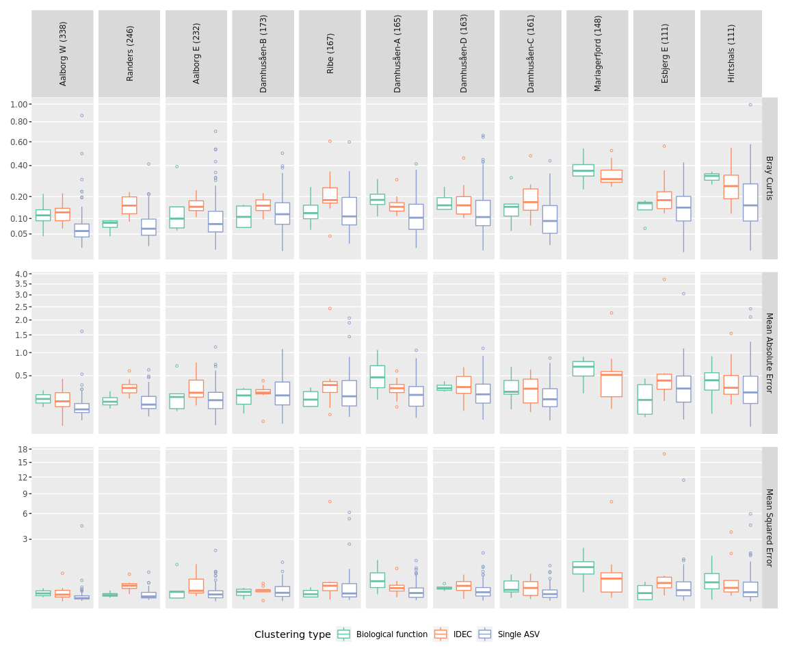
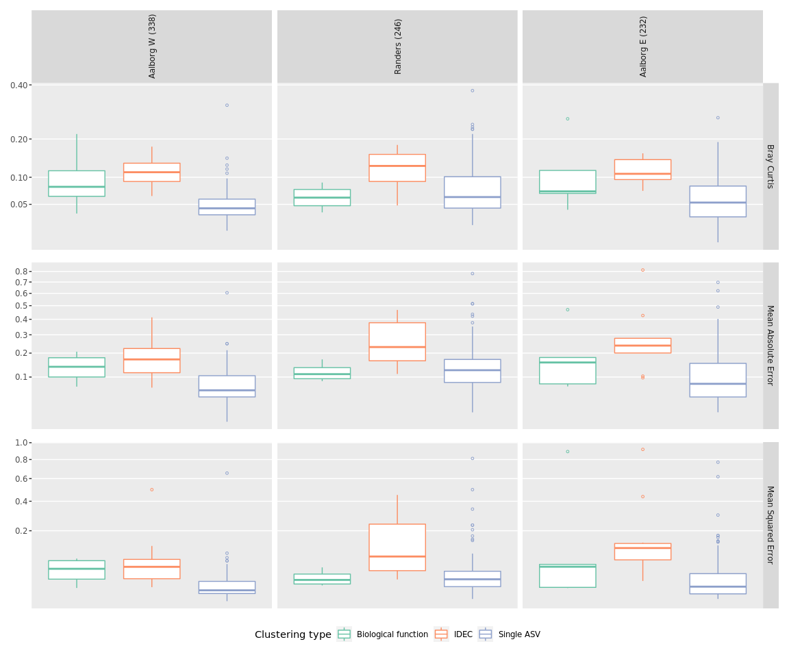
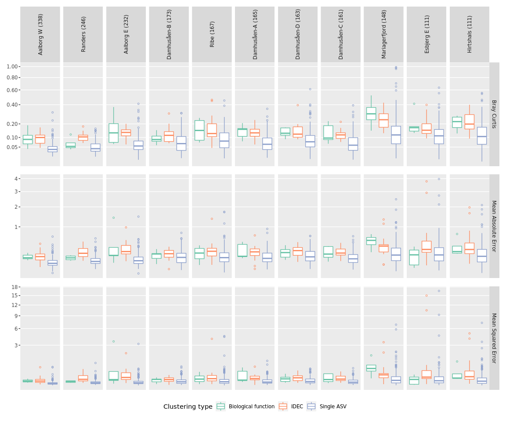

Prediction accuracy across WWTPs
================================

top 100 ASVs, 10 iterations, 200 epochs, smoothing factor 8
-----------------------------------------------------------

    plot_all("results/20220420")

    # "only_pos_func": false,
    # "pseudo_zero": 0.01,
    # "max_zeros_pct": 0.60,
    # "top_n_taxa": 100,
    # "num_features": 10,
    # "iterations": 10,
    # "max_epochs_lstm": 200,
    # "window_size": 10,
    # "num_clusters_idec": 10,
    # "tolerance_idec": 0.001,
    # "splits": [
    #     0.75,
    #     0.10,
    #     0.15
    # ]

1 iteration, 1000 max epochs
----------------------------

    # "only_pos_func": false,
    # "pseudo_zero": 0.01,
    # "max_zeros_pct": 0.60,
    # "top_n_taxa": 100,
    # "num_features": 10,
    # "iterations": 1,
    # "max_epochs_lstm": 1000,
    # "window_size": 10,
    # "num_clusters_idec": 10,
    # "tolerance_idec": 0.001,
    # "splits": [
    #     0.75,
    #     0.10,
    #     0.15
    # ]
    plot_all("results/20220421")

10 iterations, 2000 max epochs, window size 20
----------------------------------------------

    # "only_pos_func": false,
    # "pseudo_zero": 0.01,
    # "max_zeros_pct": 0.60,
    # "top_n_taxa": 100,
    # "num_features": 10,
    # "iterations": 10,
    # "max_epochs_lstm": 2000,
    # "window_size": 20,
    # "num_clusters_idec": 10,
    # "tolerance_idec": 0.001,
    # "splits": [
    #     0.75,
    #     0.10,
    #     0.15
    # ]
    plot_all("results/20220422")

top 200 ASVs, windows size 10, 20 IDEC clusters
-----------------------------------------------

    # "only_pos_func": false,
    # "pseudo_zero": 0.01,
    # "max_zeros_pct": 0.60,
    # "top_n_taxa": 200,
    # "num_features": 10,
    # "iterations": 10,
    # "max_epochs_lstm": 2000,
    # "window_size": 10,
    # "num_clusters_idec": 20,
    # "tolerance_idec": 0.001,
    # "splits": [
    #     0.75,
    #     0.10,
    #     0.15
    # ]
    plot_all("results/20220427")

5 IDEC clusters
---------------

    # "only_pos_func": false,
    # "pseudo_zero": 0.01,
    # "max_zeros_pct": 0.60,
    # "top_n_taxa": 200,
    # "num_features": 10,
    # "iterations": 10,
    # "max_epochs_lstm": 2000,
    # "window_size": 10,
    # "num_clusters_idec": 5,
    # "tolerance_idec": 0.001,
    # "splits": [
    #     0.75,
    #     0.10,
    #     0.15
    # ]
    plot_all("results/20220429")

smoothing factor 4
==================

    # "only_pos_func": false,
    # "pseudo_zero": 0.01,
    # "max_zeros_pct": 0.60,
    # "top_n_taxa": 200,
    # "num_features": 10,
    # "iterations": 10,
    # "max_epochs_lstm": 2000,
    # "window_size": 10,
    # "num_clusters_idec": 5,
    # "tolerance_idec": 0.001,
    # "smoothing_factor": 4,
    # "splits": [
    #     0.75,
    #     0.10,
    #     0.15
    # ]
    plot_all("results/20220506")

    # "metadata_date_col": "Date",
    # "tax_level": "OTU",
    # "tax_add": ["Species", "Genus"],
    # "functions": [
    #     "AOB",
    #     "NOB",
    #     "PAO",
    #     "GAO",
    #     "Filamentous"
    # ],
    # "only_pos_func": false,
    # "pseudo_zero": 0.01,
    # "max_zeros_pct": 0.60,
    # "top_n_taxa": 200,
    # "num_features": 10,
    # "iterations": 10,
    # "max_epochs_lstm": 2000,
    # "window_size": 10,
    # "num_clusters_idec": 5,
    # "tolerance_idec": 0.001,
    # "smoothing_factor": 4,
    # "splits": [
    #     0.75,
    #     0.10,
    #     0.15
    # ]
    plot_all("results/20220511_updateddata")

Aalborg West comparison of true vs predicted (smoothing factor 8)
=================================================================

Correspondence Analysis
-----------------------

    # Configuration:
    # {
    #     "abund_file": "data/datasets/Aalborg W/ASVtable.csv",
    #     "taxonomy_file": "data/datasets/Aalborg W/taxonomy.csv",
    #     "metadata_file": "data/metadata.csv",
    #     "results_dir": "results",
    #     "metadata_date_col": "Date",
    #     "tax_level": "OTU",
    #     "tax_add": ["Species", "Genus"],
    #     "functions": [
    #         "AOB",
    #         "NOB",
    #         "PAO",
    #         "GAO",
    #         "Filamentous"
    #     ],
    #     "only_pos_func": false,
    #     "pseudo_zero": 0.01,
    #     "max_zeros_pct": 0.60,
    #     "top_n_taxa": 200,
    #     "num_features": 10,
    #     "iterations": 10,
    #     "max_epochs_lstm": 2000,
    #     "window_size": 10,
    #     "num_clusters_idec": 5,
    #     "tolerance_idec": 0.001,
    #     "smoothing_factor": 8,   # <-------------
    #     "splits": [
    #         0.75,
    #         0.10,
    #         0.15
    #     ]
    # }
    results_dir <- "results/20220429/results_20220429_182545"
    AAW_20220429 <- combine_abund(
      results_dir,
      cluster_type = "abund"
    )

    AAW_20220429_reformatted <- load_data_reformatted(results_dir)

    # run data (here smoothing factor 8)
    amp_ordinate(
      AAW_20220429,
      type = "ca",
      sample_color_by = "predicted",
      sample_trajectory = "Date"
    )

    # raw reformatted data (here not smoothed)
    amp_ordinate(
      AAW_20220429_reformatted,
      type = "ca",
      sample_trajectory = "Date"
    )

Time Series example ASV1
------------------------

    # run data (here smoothing factor 8)
    amp_timeseries(
      amp_subset_taxa(
        AAW_20220429,
        "ASV1; s__midas_s_5; g__Tetrasphaera",
        normalise = FALSE
      ),
      time_variable = "Date",
      normalise = FALSE
    )

    # raw reformatted data (here not smoothed)
    amp_timeseries(
      amp_subset_taxa(
        AAW_20220429_reformatted,
        "ASV1; s__midas_s_5; g__Tetrasphaera",
        normalise = FALSE
      ),
      time_variable = "Date",
      normalise = FALSE
    )

Aalborg West comparison of true vs predicted (smoothing factor 4)
=================================================================

Correspondence Analysis
-----------------------

    # Configuration:
    # {
    #     "abund_file": "data/datasets/Aalborg W/ASVtable.csv",
    #     "taxonomy_file": "data/datasets/Aalborg W/taxonomy.csv",
    #     "metadata_file": "data/metadata.csv",
    #     "results_dir": "results",
    #     "metadata_date_col": "Date",
    #     "tax_level": "OTU",
    #     "tax_add": ["Species", "Genus"],
    #     "functions": [
    #         "AOB",
    #         "NOB",
    #         "PAO",
    #         "GAO",
    #         "Filamentous"
    #     ],
    #     "only_pos_func": false,
    #     "pseudo_zero": 0.01,
    #     "max_zeros_pct": 0.60,
    #     "top_n_taxa": 200,
    #     "num_features": 10,
    #     "iterations": 10,
    #     "max_epochs_lstm": 2000,
    #     "window_size": 10,
    #     "num_clusters_idec": 5,
    #     "tolerance_idec": 0.001,
    #     "smoothing_factor": 4,   # <-------------
    #     "splits": [
    #         0.75,
    #         0.10,
    #         0.15
    #     ]
    # }
    results_dir <- "results/20220506/results_20220506_182133"
    AAW_20220506 <- combine_abund(
      results_dir,
      cluster_type = "abund"
    )

    AAW_20220506_reformatted <- load_data_reformatted(results_dir)

    # run data (here smoothing factor 8)
    amp_ordinate(
      AAW_20220506,
      type = "ca",
      sample_color_by = "predicted",
      sample_trajectory = "Date"
    )

    # raw reformatted data (here not smoothed)
    amp_ordinate(
      AAW_20220506_reformatted,
      type = "ca",
      sample_trajectory = "Date"
    )

Time Series example ASV1
------------------------

    # run data (here smoothing factor 8)
    amp_timeseries(
      amp_subset_taxa(
        AAW_20220506,
        "ASV1; s__midas_s_5; g__Tetrasphaera",
        normalise = FALSE
      ),
      time_variable = "Date",
      normalise = FALSE
    )

    # raw reformatted data (here not smoothed)
    amp_timeseries(
      amp_subset_taxa(
        AAW_20220506_reformatted,
        "ASV1; s__midas_s_5; g__Tetrasphaera",
        normalise = FALSE
      ),
      time_variable = "Date",
      normalise = FALSE
    )

colored
=======

    #data set exactly same settings as 20220506, just with additional data output
    results_dir <- "results/20220510/results_20220510_190511"
    AAW_20220510 <- combine_abund(
      results_dir,
      cluster_type = "abund"
    )

    AAW_20220510_reformatted <- load_data_reformatted(results_dir)

    # run data (here smoothing factor 8)
    amp_ordinate(
      AAW_20220510,
      type = "ca",
      sample_color_by = "split_dataset",
      sample_trajectory = "Date"
    ) +
      scale_color_manual(
        values = c("grey50", RColorBrewer::brewer.pal(6, "Paired")[c(4:6)])
      ) +
      theme(legend.title = element_blank())

    #five number statistics of sum of reads per data set
    list.dirs(
      "results/20220506",
      full.names = TRUE,
      recursive = FALSE
    ) %>%
      lapply(function(dataset) {
        abund <- fread(
          file.path(dataset, "data_reformatted", "abundances.csv"),
          drop = 1
        )
        fivenum(rowSums(abund))
      })
