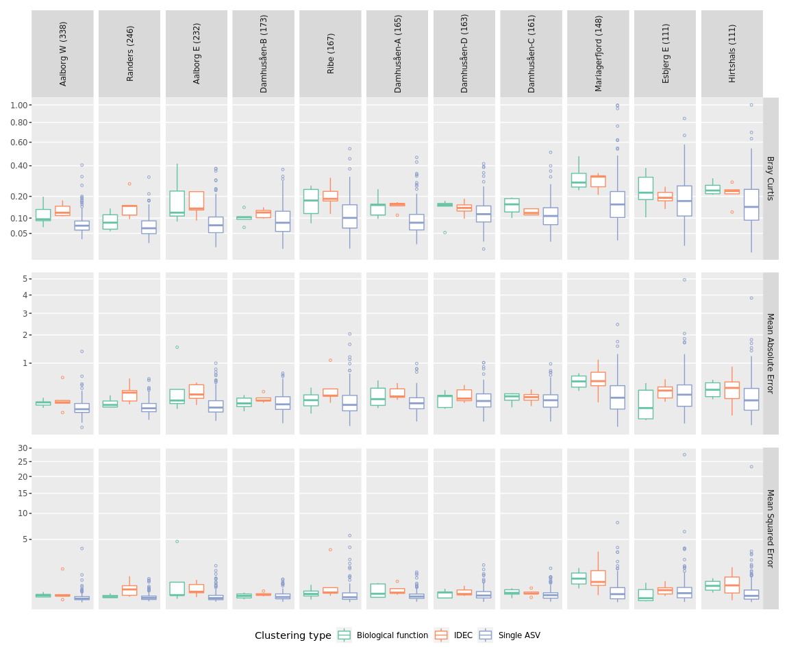
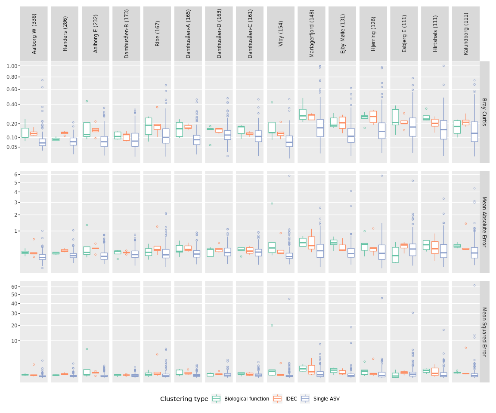
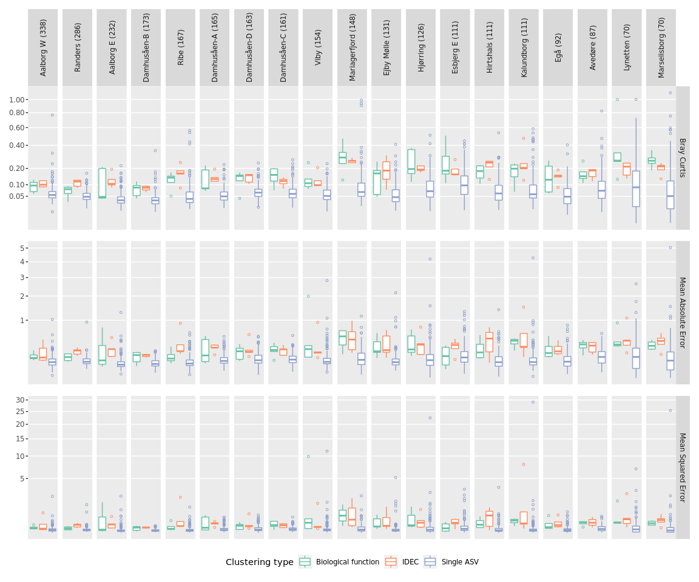
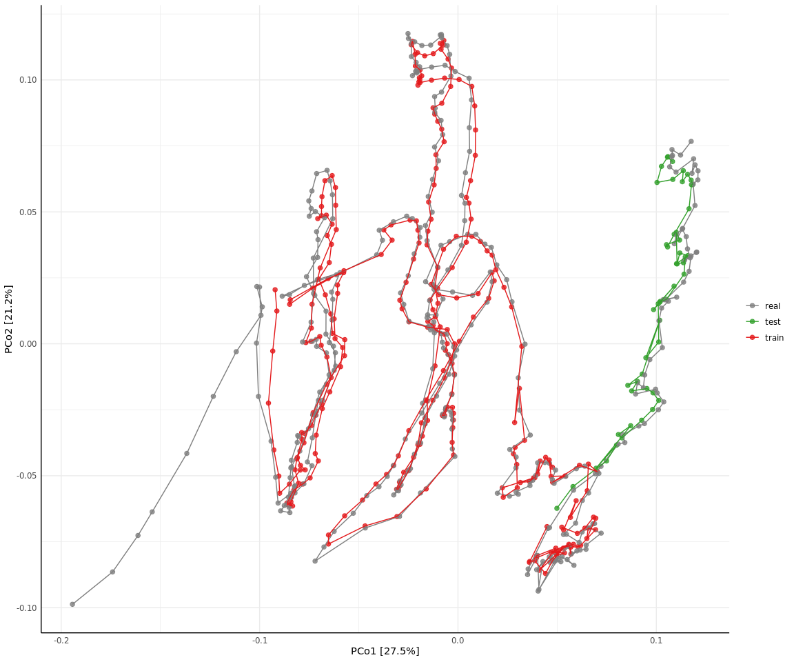

Prediction accuracy across WWTPs
================================

top 100 ASVs, 10 iterations, 200 epochs, smoothing factor 8
-----------------------------------------------------------

    plot_all("results/20220420")

    # "only_pos_func": false,
    # "pseudo_zero": 0.01,
    # "max_zeros_pct": 0.60,
    # "top_n_taxa": 100,
    # "num_features": 10,
    # "iterations": 10,
    # "max_epochs_lstm": 200,
    # "window_size": 10,
    # "num_clusters_idec": 10,
    # "tolerance_idec": 0.001,
    # "splits": [
    #     0.75,
    #     0.10,
    #     0.15
    # ]

1 iteration, 1000 max epochs
----------------------------

    # "only_pos_func": false,
    # "pseudo_zero": 0.01,
    # "max_zeros_pct": 0.60,
    # "top_n_taxa": 100,
    # "num_features": 10,
    # "iterations": 1,
    # "max_epochs_lstm": 1000,
    # "window_size": 10,
    # "num_clusters_idec": 10,
    # "tolerance_idec": 0.001,
    # "splits": [
    #     0.75,
    #     0.10,
    #     0.15
    # ]
    plot_all("results/20220421")

10 iterations, 2000 max epochs, window size 20
----------------------------------------------

    # "only_pos_func": false,
    # "pseudo_zero": 0.01,
    # "max_zeros_pct": 0.60,
    # "top_n_taxa": 100,
    # "num_features": 10,
    # "iterations": 10,
    # "max_epochs_lstm": 2000,
    # "window_size": 20,
    # "num_clusters_idec": 10,
    # "tolerance_idec": 0.001,
    # "splits": [
    #     0.75,
    #     0.10,
    #     0.15
    # ]
    plot_all("results/20220422")

top 200 ASVs, windows size 10, 20 IDEC clusters
-----------------------------------------------

    # "only_pos_func": false,
    # "pseudo_zero": 0.01,
    # "max_zeros_pct": 0.60,
    # "top_n_taxa": 200,
    # "num_features": 10,
    # "iterations": 10,
    # "max_epochs_lstm": 2000,
    # "window_size": 10,
    # "num_clusters_idec": 20,
    # "tolerance_idec": 0.001,
    # "splits": [
    #     0.75,
    #     0.10,
    #     0.15
    # ]
    plot_all("results/20220427")

5 IDEC clusters
---------------

    # "only_pos_func": false,
    # "pseudo_zero": 0.01,
    # "max_zeros_pct": 0.60,
    # "top_n_taxa": 200,
    # "num_features": 10,
    # "iterations": 10,
    # "max_epochs_lstm": 2000,
    # "window_size": 10,
    # "num_clusters_idec": 5,
    # "tolerance_idec": 0.001,
    # "splits": [
    #     0.75,
    #     0.10,
    #     0.15
    # ]
    plot_all("results/20220429")

smoothing factor 4
==================

    # "only_pos_func": false,
    # "pseudo_zero": 0.01,
    # "max_zeros_pct": 0.60,
    # "top_n_taxa": 200,
    # "num_features": 10,
    # "iterations": 10,
    # "max_epochs_lstm": 2000,
    # "window_size": 10,
    # "num_clusters_idec": 5,
    # "tolerance_idec": 0.001,
    # "smoothing_factor": 4,
    # "splits": [
    #     0.75,
    #     0.10,
    #     0.15
    # ]
    plot_all("results/20220506")

    # "metadata_date_col": "Date",
    # "tax_level": "OTU",
    # "tax_add": ["Species", "Genus"],
    # "functions": [
    #     "AOB",
    #     "NOB",
    #     "PAO",
    #     "GAO",
    #     "Filamentous"
    # ],
    # "only_pos_func": false,
    # "pseudo_zero": 0.01,
    # "max_zeros_pct": 0.60,
    # "top_n_taxa": 200,
    # "num_features": 10,
    # "iterations": 10,
    # "max_epochs_lstm": 2000,
    # "window_size": 10,
    # "num_clusters_idec": 5,
    # "tolerance_idec": 0.001,
    # "smoothing_factor": 4,
    # "splits": [
    #     0.75,
    #     0.10,
    #     0.15
    # ]
    plot_all("results/20220511_updateddata")

    # "functions": [
    #     "AOB",
    #     "NOB",
    #     "PAO",
    #     "GAO",
    #     "Filamentous"
    # ],
    # "only_pos_func": false,
    # "pseudo_zero": 0.01,
    # "max_zeros_pct": 0.60,
    # "top_n_taxa": 200,
    # "num_features": 10,
    # "iterations": 10,
    # "max_epochs_lstm": 2000,
    # "window_size": 10,
    # "num_clusters_idec": 5,
    # "tolerance_idec": 0.001,
    # "smoothing_factor": 4,
    # "splits": [
    #     0.85,
    #     0.0,
    #     0.15
    # ]
    plot_all("results/20220518_updateddata")

Aalborg West comparison of true vs predicted (smoothing factor 8)
=================================================================

Correspondence Analysis
-----------------------

    # Configuration:
    # {
    #     "abund_file": "data/datasets/Aalborg W/ASVtable.csv",
    #     "taxonomy_file": "data/datasets/Aalborg W/taxonomy.csv",
    #     "metadata_file": "data/metadata.csv",
    #     "results_dir": "results",
    #     "metadata_date_col": "Date",
    #     "tax_level": "OTU",
    #     "tax_add": ["Species", "Genus"],
    #     "functions": [
    #         "AOB",
    #         "NOB",
    #         "PAO",
    #         "GAO",
    #         "Filamentous"
    #     ],
    #     "only_pos_func": false,
    #     "pseudo_zero": 0.01,
    #     "max_zeros_pct": 0.60,
    #     "top_n_taxa": 200,
    #     "num_features": 10,
    #     "iterations": 10,
    #     "max_epochs_lstm": 2000,
    #     "window_size": 10,
    #     "num_clusters_idec": 5,
    #     "tolerance_idec": 0.001,
    #     "smoothing_factor": 8,   # <-------------
    #     "splits": [
    #         0.75,
    #         0.10,
    #         0.15
    #     ]
    # }
    results_dir <- "results/20220429/results_20220429_182545"
    AAW_20220429 <- combine_abund(
      results_dir,
      cluster_type = "abund"
    )

    AAW_20220429_reformatted <- load_data_reformatted(results_dir)

    # run data (here smoothing factor 8)
    amp_ordinate(
      AAW_20220429,
      type = "ca",
      sample_color_by = "predicted",
      sample_trajectory = "Date"
    )

    # raw reformatted data (here not smoothed)
    amp_ordinate(
      AAW_20220429_reformatted,
      type = "ca",
      sample_trajectory = "Date"
    )

Time Series example ASV1
------------------------

    # run data (here smoothing factor 8)
    amp_timeseries(
      amp_subset_taxa(
        AAW_20220429,
        "ASV1; s__midas_s_5; g__Tetrasphaera",
        normalise = FALSE
      ),
      time_variable = "Date",
      normalise = FALSE
    )

    # raw reformatted data (here not smoothed)
    amp_timeseries(
      amp_subset_taxa(
        AAW_20220429_reformatted,
        "ASV1; s__midas_s_5; g__Tetrasphaera",
        normalise = FALSE
      ),
      time_variable = "Date",
      normalise = FALSE
    )

Aalborg West comparison of true vs predicted (smoothing factor 4)
=================================================================

Correspondence Analysis
-----------------------

    # Configuration:
    # {
    #     "abund_file": "data/datasets/Aalborg W/ASVtable.csv",
    #     "taxonomy_file": "data/datasets/Aalborg W/taxonomy.csv",
    #     "metadata_file": "data/metadata.csv",
    #     "results_dir": "results",
    #     "metadata_date_col": "Date",
    #     "tax_level": "OTU",
    #     "tax_add": ["Species", "Genus"],
    #     "functions": [
    #         "AOB",
    #         "NOB",
    #         "PAO",
    #         "GAO",
    #         "Filamentous"
    #     ],
    #     "only_pos_func": false,
    #     "pseudo_zero": 0.01,
    #     "max_zeros_pct": 0.60,
    #     "top_n_taxa": 200,
    #     "num_features": 10,
    #     "iterations": 10,
    #     "max_epochs_lstm": 2000,
    #     "window_size": 10,
    #     "num_clusters_idec": 5,
    #     "tolerance_idec": 0.001,
    #     "smoothing_factor": 4,   # <-------------
    #     "splits": [
    #         0.75,
    #         0.10,
    #         0.15
    #     ]
    # }
    results_dir <- "results/20220506/results_20220506_182133"
    AAW_20220506 <- combine_abund(
      results_dir,
      cluster_type = "abund"
    )

    AAW_20220506_reformatted <- load_data_reformatted(results_dir)

    # run data (here smoothing factor 8)
    amp_ordinate(
      AAW_20220506,
      type = "ca",
      sample_color_by = "predicted",
      sample_trajectory = "Date"
    )

    # raw reformatted data (here not smoothed)
    amp_ordinate(
      AAW_20220506_reformatted,
      type = "ca",
      sample_trajectory = "Date"
    )

Time Series example ASV1
------------------------

    # run data (here smoothing factor 8)
    amp_timeseries(
      amp_subset_taxa(
        AAW_20220506,
        "ASV1; s__midas_s_5; g__Tetrasphaera",
        normalise = FALSE
      ),
      time_variable = "Date",
      normalise = FALSE
    )

    # raw reformatted data (here not smoothed)
    amp_timeseries(
      amp_subset_taxa(
        AAW_20220506_reformatted,
        "ASV1; s__midas_s_5; g__Tetrasphaera",
        normalise = FALSE
      ),
      time_variable = "Date",
      normalise = FALSE
    )

colored
=======

    #data set exactly same settings as 20220506, just with additional data output
    results_dir <- "results/20220510/results_20220510_190511"
    AAW_20220510 <- combine_abund(
      results_dir,
      cluster_type = "abund"
    )

    AAW_20220510_reformatted <- load_data_reformatted(results_dir)

    # run data (here smoothing factor 4)
    amp_ordinate(
      AAW_20220510,
      type = "ca",
      sample_color_by = "split_dataset",
      sample_trajectory = "Date"
    ) +
      scale_color_manual(
        values = c("grey50", RColorBrewer::brewer.pal(6, "Paired")[c(4:6)])
      ) +
      theme(legend.title = element_blank())

(updated data) Aalborg West comparison of true vs predicted (smoothing factor 4)
================================================================================

Correspondence Analysis
-----------------------

    # Configuration:
    # {
    #     "abund_file": "data/datasets/Aalborg W/ASVtable.csv",
    #     "taxonomy_file": "data/datasets/Aalborg W/taxonomy.csv",
    #     "metadata_file": "data/metadata.csv",
    #     "results_dir": "results",
    #     "metadata_date_col": "Date",
    #     "tax_level": "OTU",
    #     "tax_add": ["Species", "Genus"],
    #     "functions": [
    #         "AOB",
    #         "NOB",
    #         "PAO",
    #         "GAO",
    #         "Filamentous"
    #     ],
    #     "only_pos_func": false,
    #     "pseudo_zero": 0.01,
    #     "max_zeros_pct": 0.60,
    #     "top_n_taxa": 200,
    #     "num_features": 10,
    #     "iterations": 10,
    #     "max_epochs_lstm": 2000,
    #     "window_size": 10,
    #     "num_clusters_idec": 5,
    #     "tolerance_idec": 0.001,
    #     "smoothing_factor": 4,
    #     "splits": [
    #         0.85,
    #         0.0,
    #         0.15
    #     ]
    # }
    results_batch_dir <- "results/20220518_updateddata"
    results_dir <- file.path(results_batch_dir, "results_20220513_200906")
    AAW_20220518 <- combine_abund(
      results_dir,
      cluster_type = "abund"
    )

    AAW_20220518_reformatted <- load_data_reformatted(results_dir)

    amp_ordinate(
      AAW_20220518,
      type = "ca",
      sample_color_by = "split_dataset",
      sample_trajectory = "Date"
    ) +
      scale_color_manual(
        values = c("grey50", RColorBrewer::brewer.pal(6, "Paired")[c(4,6)])
      ) +
      theme(legend.title = element_blank())

    # raw reformatted data (here not smoothed)
    amp_ordinate(
      AAW_20220518_reformatted,
      type = "ca",
      sample_trajectory = "Date"
    )

(updated data) Time Series example ASV1
---------------------------------------

    amp_timeseries(
      amp_subset_taxa(
        AAW_20220518,
        "ASV1; s__midas_s_5; g__Tetrasphaera",
        normalise = FALSE
      ),
      time_variable = "Date",
      normalise = FALSE
    )

    # raw reformatted data (here not smoothed)
    amp_timeseries(
      amp_subset_taxa(
        AAW_20220518_reformatted,
        "ASV1; s__midas_s_5; g__Tetrasphaera",
        normalise = FALSE
      ),
      time_variable = "Date",
      normalise = FALSE
    )

    runs <- list.files(
      results_batch_dir,
      pattern = "^results_.*",
      full.names = TRUE
    )

    d_list <- lapply(runs, read_results)
    names(d_list) <- runs
    combined <- rbindlist(
      d_list,
      idcol = "results_folder",
      fill = TRUE
    )[
      !is.na(cluster_type) & value > 0
    ]
    combined[cluster_type == "Single ASV" & error_metric == "Bray Curtis", fivenum(value)]

    ## [1] 0.0000372529 0.0370060094 0.0538450181 0.0843695626 1.1100714207

    #five number statistics of sum of reads per data set
    list.dirs(
      "results/20220518_updateddata",
      full.names = TRUE,
      recursive = FALSE
    ) %>%
      lapply(function(dataset) {
        abund <- fread(
          file.path(dataset, "data_reformatted", "abundances.csv"),
          drop = 1
        )
        fivenum(rowSums(abund))
      })

    ## [[1]]
    ## [1] 40.6570 47.7070 52.3790 57.3065 67.4100
    ## 
    ## [[2]]
    ## [1] 41.128 51.887 55.360 58.442 75.660
    ## 
    ## [[3]]
    ## [1] 53.4940 58.3095 59.8120 62.1140 67.8940
    ## 
    ## [[4]]
    ## [1] 49.885 56.615 61.032 65.476 72.087
    ## 
    ## [[5]]
    ## [1] 53.928 59.301 61.936 64.700 72.590
    ## 
    ## [[6]]
    ## [1] 51.789 59.129 61.528 63.898 70.613
    ## 
    ## [[7]]
    ## [1] 49.2590 57.7275 60.5240 62.9220 70.0980
    ## 
    ## [[8]]
    ## [1] 48.4340 54.0100 56.0840 57.7085 61.9190
    ## 
    ## [[9]]
    ## [1] 48.8510 56.0645 58.8760 60.2075 64.3550
    ## 
    ## [[10]]
    ## [1] 52.9240 56.1445 57.5530 59.1960 61.9770
    ## 
    ## [[11]]
    ## [1] 50.7650 59.1565 64.9350 68.4275 72.4230
    ## 
    ## [[12]]
    ## [1] 18.6050 61.9760 66.7415 71.4050 81.1020
    ## 
    ## [[13]]
    ## [1] 47.4450 62.0635 65.9230 68.5215 74.7450
    ## 
    ## [[14]]
    ## [1] 51.900 59.833 61.615 62.618 65.633
    ## 
    ## [[15]]
    ## [1] 45.6450 57.7765 61.1380 63.9665 68.4860
    ## 
    ## [[16]]
    ## [1] 52.079 59.614 64.365 66.476 69.926
    ## 
    ## [[17]]
    ## [1] 17.043 54.401 57.281 59.826 72.965
    ## 
    ## [[18]]
    ## [1] 43.2800 51.9055 53.8930 56.3070 64.1840
    ## 
    ## [[19]]
    ## [1] 40.2600 55.4790 59.1075 62.3370 67.7310
